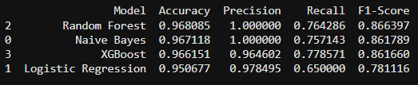

[README (2).md](https://github.com/user-attachments/files/26169206/README.2.md)
# Spam Classifier for Emails / Text Messages

## Update
*This project was created as the induction task for the **WebWiz Technical Club at NIT Rourkela**. I have now been officially inducted into the club as an **AI/ML Team Member**.*

---

## Project Overview

This project builds a **machine learning based spam classifier** for SMS or email messages. The primary model used is **Multinomial Naive Bayes**, which achieved **100 percent precision**.

In spam detection systems, **precision is extremely important** because misclassifying an important message such as an interview call or official communication as spam can lead to critical information being missed.

Other models including **Random Forest**, **Logistic Regression**, and **XGBoost** were also trained and evaluated for comparison.

**Final Achieved F1 Score:** **86.1789**

---

## Dataset

**Dataset used**

https://raw.githubusercontent.com/justmarkham/pycon-2016-tutorial/master/data/sms.tsv

The dataset contains SMS messages labeled as:

- **Ham** – legitimate message  
- **Spam** – unwanted promotional or fraudulent message

---

# Project Workflow

## 1. Data Importing

The dataset is imported using **pandas** and structured into a dataframe containing **message labels and message text**. Initial inspection is performed to verify **data quality** and understand **class distribution**.

---

## 2. Data Pre Processing

Text data is cleaned before modeling. This includes:

- Converting text to **lowercase**
- **Removing punctuation**
- **Tokenization**
- **Stopword removal**
- **Stemming**

These steps ensure the model learns **meaningful textual patterns instead of noise**.

---

## 3. Exploratory Data Analysis

EDA is performed to understand the dataset through:

- **Spam versus ham distribution**
- **Message length comparison**
- **Word frequency analysis**

This helps identify **linguistic patterns commonly found in spam messages**.

---

## 4. Text Vectorization

Machine learning models cannot interpret **raw text directly**. Messages are therefore converted into **numerical feature vectors** using **Bag of Words** or **TF IDF** representations so the algorithms can learn **word frequency patterns**.

---

## 5. Model Training and Evaluation

Multiple **scikit learn models** are trained and compared using metrics such as:

- **Precision**
- **Recall**
- **Accuracy**
- **F1 Score**

Models implemented include:

- **Multinomial Naive Bayes**
- **Logistic Regression**
- **Random Forest**
- **XGBoost**

**Multinomial Naive Bayes achieved 100 percent precision**, making it the most reliable model for **minimizing false spam classification**.

---

# Results

**Multinomial Naive Bayes produced the highest precision among all models**, which is the most critical metric for spam detection systems.

**Final F1 Score:** **86.1789**
